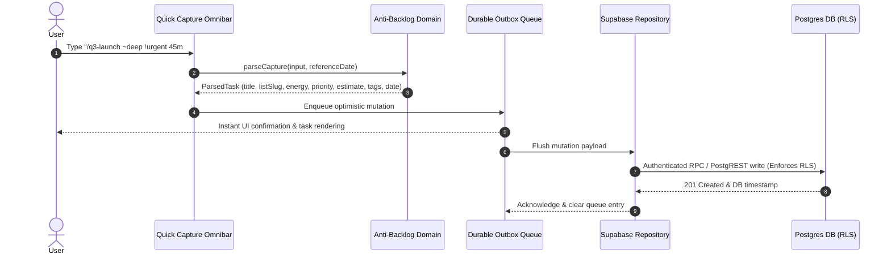

# Architecture Guide & System Design

This document details the architectural boundaries, domain concepts, data flow lifecycles, and extension points for **Task-Laureate**.

---

## 1. System Architecture & Boundaries (C4 Model)

```mermaid
flowchart TB
  subgraph Client [Client Application (Browser / PWA)]
    UI["React 18 + TanStack Router (A11y & Semantic Themes)"]
    Omnibar["Quick Capture Omnibar (Natural Language Parser)"]
    DomainEngine["Core Domain Engine (Anti-Backlog Policy & Capacity Estimator)"]
    OutboxStore["Durable Mutation Outbox & Undo Journal"]
    RepoAdapter["Repository Gateway & Cache Layer (TanStack Query)"]

    UI --> Omnibar
    Omnibar --> DomainEngine
    DomainEngine --> OutboxStore
    OutboxStore --> RepoAdapter
  end

  subgraph Cloud [Backend & Infrastructure Services]
    direction TB
    SupaAuth["Supabase GoTrue Auth (PKCE Flow)"]
    PostgresRLS["PostgreSQL Database with Row-Level Security (RLS)"]
    Realtime["Supabase Realtime Channel Engine"]
    Storage["Supabase Object Storage (Task Attachments)"]
    EdgeAPI["Vercel / Edge API Functions (Notification Dispatch & Invites)"]
    GeminiAI["Google Gemini AI API (Smart Decomposition Preview)"]

    RepoAdapter <-->|HTTPS REST / PostgREST| PostgresRLS
    RepoAdapter <-->|OAuth / PKCE Session| SupaAuth
    RepoAdapter <-->|WebSockets| Realtime
    RepoAdapter <-->|S3 Compatible API| Storage
    DomainEngine -.->|Opt-in Preview| GeminiAI
    EdgeAPI --> PostgresRLS
  end

  subgraph NotificationProviders [Notification & Delivery Channels]
    WebPush["Web Push VAPID"]
    Email["Transactional Email (Invites & Reminders)"]
    EdgeAPI --> WebPush
    EdgeAPI --> Email
  end
```

---

## 2. Core Domain Layer & Invariants

The domain layer in `src/core/domain` is strictly pure TypeScript with zero framework, DOM, or vendor dependencies.

### Domain Principles:
1. **Anti-Backlog Philosophy**: Tasks are categorized by cognitive energy (`deep`, `light`, `quick`) and estimated duration, allowing users to find one realistic next action rather than feeling overwhelmed by an infinite backlog.
2. **Deterministic Natural Language Parsing**: The omnibar parser interprets `/lists`, `~energy`, `!priority`, `#tags`, `30m/2h`, and relative dates (`today`, `tomorrow`) deterministically without unpredictable AI latency or cost.
3. **Optimistic Local-First Mutations**: State transitions immediately update UI state and append an operation to the durable outbox and undo journal. If offline or network errors occur, the mutations persist in storage and replay automatically.

---

## 3. Data Flow & Synchronization Lifecycle



---

## 4. Extension Points

- **Persistence Backend**: Implement `TodoRepository` or `CollaborationRepository` contracts in `src/core/contracts/domain.ts` to connect custom backends.
- **Notification Adapters**: Implement the normalized adapter interface in `api/notifications/providers.mjs`.
- **Custom AI Orchestration**: Extend `src/infrastructure/antiBacklog/aiDecomposition.ts` to plug in alternative LLMs or custom local fine-tuned models.

---

## 5. Security & Authorization Layer

- **Database-Enforced Authorization**: Collaboration permissions (`owner`, `editor`, `viewer`) live in PostgreSQL predicates and Row-Level Security policies.
- **Client Role Affordances**: Client-side UI disables read-only controls gracefully, but all actual enforcement is secured at the Postgres API boundary.
